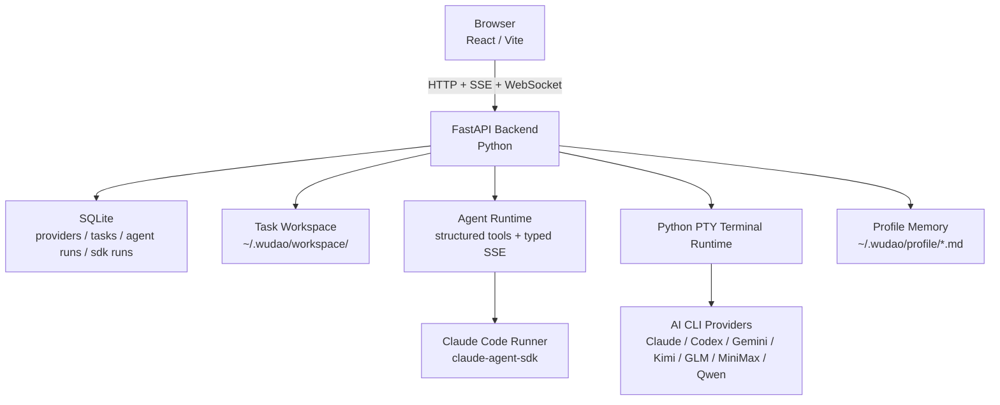

# AGENTS.md

本文件说明在本仓库中协作时的项目背景、真实代码结构、工作方式与关键约束。

## 项目概览

悟道（Wudao）是一个个人 AI 工作站，用来把多种 AI 工具串成可执行、可追踪、可沉淀的任务闭环。

- 当前重点：任务中心、Agentic Chat、任务工作台与 Claude Code Runner
- 核心闭环：自然语言建任务 → Agentic Chat 澄清/规划 → 结构化工具调用 → 生成或同步 `AGENTS.md` → 终端 / Agent Runner 执行 → 完成归档
- 技术形态：纯 Web、前后端分离、前端 TypeScript + 后端 Python、pnpm monorepo
- 主产物模型：每个任务 workspace 中的 `AGENTS.md` 是任务上下文单一事实源，`CLAUDE.md` 与 `GEMINI.md` 是兼容软链

## 当前能力基线

- 前端是 Vite + React 19 + TypeScript + Tailwind CSS v4 + HeroUI v3 + zustand，入口在 `packages/web/src/App.tsx`
- 后端是 FastAPI + sqlite3 + Python PTY，入口在 `packages/server/src/app.py`
- 任务数据、Provider 配置、Agent Chat run/message、Claude Code Runner run/event 均持久化到 SQLite
- Agentic Chat 使用 typed SSE、结构化 timeline 与工具协议，主要实现位于 `packages/server/src/task_agent_chat.py` 与 `packages/server/src/agent_runtime/`
- Agent 工具包括 workspace 列表/读取/搜索/写入/patch、跨任务读取 `AGENTS.md`、终端快照、`invoke_claude_code_runner`
- 任务详情页是左侧 Agentic Chat + 右侧三个可独立开关的抽屉：终端、Agent Runner、产物
- 终端通过 `/ws/terminal` 管理 Python PTY，支持 Claude、Codex、Gemini、Kimi、GLM、MiniMax、Qwen 等 CLI
- 记忆页只维护本地用户记忆与 Wudao Agent 全局记忆，并注入任务解析、文档生成、legacy chat 与 Agentic Chat

## 先看哪些文档

当前仓库内仍存在并应优先维护的文档：

- 项目总览与启动方式：`README.md`
- 当前开发进度：`status.md`
- 用户视角变更记录：`docs/changelog.md`
- 前端开发规范：`docs/design/frontend-guidelines.md`
- HeroUI 前端重构计划：`docs/design/heroui-frontend-refactor-plan.md`
- 大功能或临时计划：优先新建到 `docs/design/`，并在本节补索引

不要引用已经不存在的设计文档；如果需要恢复某个长期设计说明，先创建明确命名的文档，再把入口补到这里。

## 核心工作方式

这是一个典型的 VibeCoding 项目：用户给方向和判断，你负责方案、实现质量、边界处理与测试质量。

### 关键原则

- 文档先行：接口、数据结构、任务流程或 UI 约定变化时，先更新承载文档
- Plan 先行：中大型需求先写计划，再进入大规模编码
- 渐进交付：一次只做一个明确可感知变化
- 测试兜底：新功能和修复都按 TDD 思路补最小可验证覆盖
- 重复脚本化：重复操作两次以上就沉淀到 `scripts/`
- 完成留痕：每轮结束后按需更新 `status.md` 与 `docs/changelog.md`

### 执行节奏

接到需求后：

1. 确认目标、边界与验收标准
2. 阅读最近的 `AGENTS.md`、相关代码与现有测试
3. 推荐最简单可靠的方案，并明确本轮会改哪些文件
4. 按“数据/状态 → 核心逻辑 → 约束层 → 集成层”推进
5. 每完成一个子功能就做最小验证，保证主流程始终可运行

### 大功能要求

- 中大型需求先在 `docs/design/` 下写计划文档
- 计划文档至少包含：目标、范围、步骤、风险、测试方案
- 未完成计划评审前，不直接进入大规模编码

## 分层 AGENTS.md 约定

- 根目录 `AGENTS.md`：项目总览、全局流程、跨端协作规则
- `packages/web/AGENTS.md`：前端组件、状态管理、交互约束
- `packages/server/AGENTS.md`：后端接口、数据一致性、Agent Runtime、终端与 Runner 约束
- `scripts/AGENTS.md`：脚本规范与高频操作入口

进入子目录工作时，优先遵循离当前目录最近的 `AGENTS.md`，并继承上层规则。

## 测试与质量要求

### TDD 基线

- Red：先写失败测试，证明需求可验证
- Green：只写让测试通过的最小实现
- Refactor：在测试全绿前提下整理结构

### 测试分层

| 层级 | 要求 |
|------|------|
| Service / Store 层 | 必测，优先单元测试 |
| Route / WebSocket / SSE 层 | 关键路径做集成测试 |
| Agent Runtime / SDK Runner / Terminal | 涉及状态机、恢复、取消、并发时必须补回归测试 |
| 组件层 | 关键交互、布局计算、渲染分支按需补测试 |

### 技术约定

- 提交前默认执行 `pnpm test`；仅文档变更可说明未跑测试
- 后端数据库测试使用临时 SQLite，不依赖现有本地数据文件
- 后端 Route / WebSocket / SSE 测试通过 FastAPI `TestClient` 执行，并 mock 外部依赖
- Store 测试优先 mock 整个 API 模块，并直接控制 store 初始状态
- 后端测试放在 `packages/server/tests/`，前端测试文件与源文件同目录，命名为 `xxx.test.ts` 或 `xxx.test.tsx`

## 脚本规范

- 启动、迁移、发布、批处理等重复操作优先落为 `scripts/*.sh`
- 仓库脚本统一使用 bash shebang 与 `set -euo pipefail`
- 脚本应可重复执行、参数清晰、失败即退出
- 新增或更新脚本后，同步更新 `scripts/AGENTS.md` 与本文件中的常用命令
- 临时文件放到仓库 `workspace/` 下；该目录已被 git 忽略

## 安全边界

以下操作默认禁止，除非用户明确授权：

- 删除系统关键文件
- 执行高风险 shell 命令
- 访问项目目录之外的路径

实现 workspace / open-path / Agent 工具时必须走现有路径守卫，避免任务工具读写任务 workspace 之外的文件。

## 技术栈

- Monorepo：pnpm workspace
- 前端：Vite 6 + React 19 + TypeScript 5 + Tailwind CSS v4 + HeroUI v3 + zustand + i18next + lucide-react + framer-motion
- 后端：FastAPI + WebSocket + SSE + Python PTY + sqlite3 + httpx + claude-agent-sdk
- 终端渲染：xterm.js
- 运行时：Node.js 22+、Python 3.12+，默认通过 `uv` 管理 Python 依赖与测试

## 常用命令

```bash
pnpm install
pnpm dev
./scripts/dev.sh

pnpm --filter web dev
pnpm --filter web build
pnpm --filter web test
pnpm --filter web test:watch
pnpm --filter web exec tsc --noEmit --noUnusedLocals --noUnusedParameters

pnpm --filter server dev
pnpm --filter server start
pnpm --filter server test
pnpm --filter server test:watch

pnpm test
```

- 根目录 `pnpm install` 会在缺少系统 `uv` 时自动 bootstrap 项目本地 `uv`
- `pnpm install` 会继续同步 `packages/server` 的 Python 环境
- `uv` 缓存固定在仓库 `workspace/uv-cache`；项目本地 `uv` 会安装到 `workspace/tools/uv`
- `pnpm dev` 由 `scripts/dev.sh` 同时拉起前端 Vite 与后端 `uvicorn --reload`

## 系统架构



### 架构说明

- 前端核心视图包括 Dashboard、任务列表/工作台、记忆页、设置页
- 后端负责任务接口、Provider 设置、用量聚合、记忆读写、Agent Runtime、SDK Runner、终端 PTY 与数据持久化
- 任务工作台统一承载对话、执行、终端、产物，不再维护独立工作台入口
- Agent Runtime 写入结构化 `task_agent_runs` / `task_agent_messages`，legacy `tasks.chat_messages` 仅保留兼容投影

## 关键数据与目录

- 运行根目录：`WUDAO_HOME`，默认 `~/.wudao`
- 数据库：`WUDAO_DB_PATH` 或默认 `~/.wudao/wudao.db`
- 任务工作区：`~/.wudao/workspace/<taskId>/`
- 全局记忆：`~/.wudao/profile/user-memory.md` 与 `~/.wudao/profile/wudao-agent-memory.md`
- 主产物：任务 workspace 下的 `AGENTS.md`
- 兼容软链：根目录和任务 workspace 下的 `CLAUDE.md`、`GEMINI.md` 均指向 `AGENTS.md`
- 仓库临时目录：`workspace/`

## 项目结构

```text
wudao/
├── AGENTS.md
├── CLAUDE.md -> AGENTS.md
├── GEMINI.md -> AGENTS.md
├── README.md
├── docs/
│   ├── changelog.md
│   └── design/frontend-guidelines.md
├── packages/
│   ├── web/       # React 前端
│   └── server/    # FastAPI 后端
├── scripts/       # dev / uv bootstrap / Python sync
├── status.md
├── package.json
└── pnpm-workspace.yaml
```

## 新 Session 接续

开启新 session 时，先做以下检查：

1. 读取本文件，了解全局规则
2. 读取 `status.md`，确认当前进度与已知问题
3. 查看最近 `git log`，补齐最新变更背景
4. 确认项目是否可运行（依赖、构建、测试状态）

然后先向用户简要同步当前状态，再继续执行新需求。
