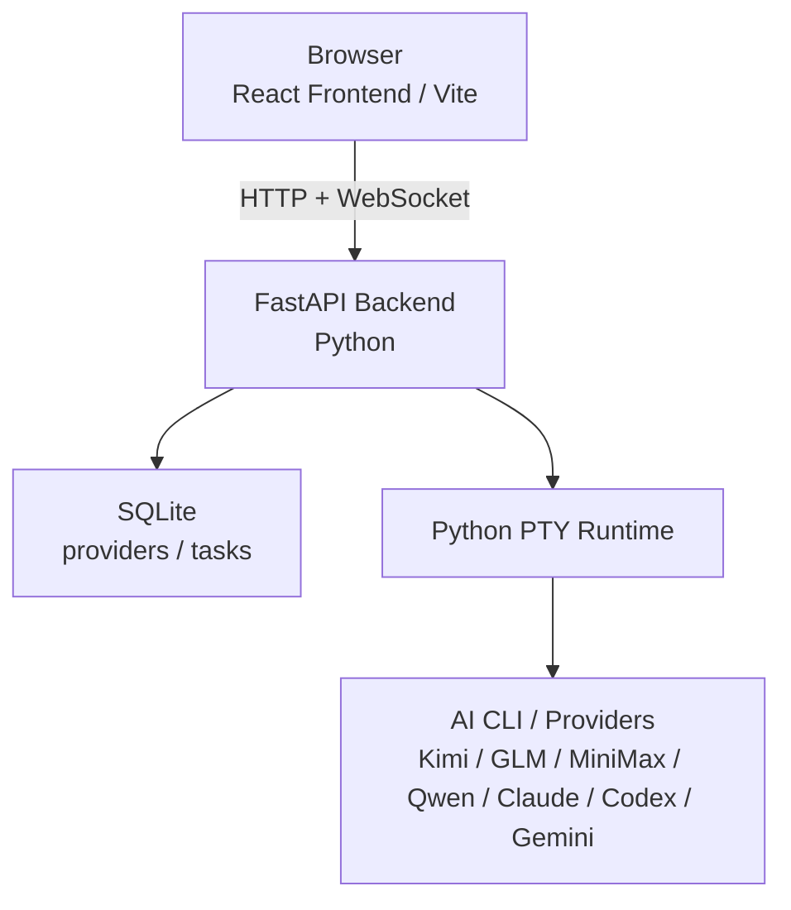

# AGENTS.md

本文件用于说明在本仓库中协作时的项目背景、工作方式与关键约束。

## 项目概览

悟道（Wudao）是一个个人 AI 工作站，用来把多种 AI 工具串成可执行、可追踪、可沉淀的任务闭环。

- 当前重点：任务中心
- 核心闭环：自然语言建任务 → 规划对话 → 生成 `AGENTS.md` → 终端执行 → 完成归档
- 技术形态：纯 Web、前后端分离、前端 TypeScript + 后端 Python、pnpm monorepo

### 当前演进方向

1. 先把任务中心体验打磨稳定
2. 再补记忆系统与经验沉淀
3. 后续扩展到学习、阅读、生活等场景
4. 长期目标是可信的主动型智能代理

## 先看哪些文档

- 任务工作台方案：`docs/design/task-workspace-integration.md`
- 任务上下文注入：`docs/design/task-context-injection.md`
- OpenViking 记忆管理：`docs/design/openviking-context-integration.md`
- Agentic Chat 工具化：`docs/design/agentic-chat-tooling.md`
- 后端 Python 重构计划：`docs/design/server-python-refactor.md`
- 前端开发规范：`docs/design/frontend-guidelines.md`
- 大功能计划模板：`docs/design/feature-plan-template.md`
- 当前开发进度：`status.md`
- 用户视角变更记录：`docs/changelog.md`

### 文档规则

- 需求、接口、数据结构变更时，先更新文档，再改代码
- 同类内容优先更新原文档，不新增 `*-v2.md`、`*-final.md`
- 只有确实没有承载位置时才新建文档，并补到上面的索引中

## 核心工作方式

这是一个典型的 VibeCoding 项目：用户给方向和判断，你负责方案、实现质量、边界处理与测试质量。

### 关键原则

- 文档先行：先看清背景、范围、约束，再动代码
- Plan 先行：中大型需求先出计划，再实现
- 渐进交付：一次只做一个明确可感知变化
- 测试兜底：新功能和修复都走 TDD 思路
- 重复脚本化：重复操作两次以上就沉淀到 `scripts/`
- 完成留痕：每轮结束后更新 `status.md` 与 `docs/changelog.md`

### 执行节奏

接到需求后：

1. 先确认目标、边界与验收标准
2. 推荐一个最简单可靠的方案
3. 明确本轮会改哪些文件，再开始修改
4. 按“数据/状态 → 核心逻辑 → 约束层 → 集成层”推进
5. 每完成一个子功能就做最小验证，保证主流程始终可运行

### 大功能要求

- 中大型需求先基于 `docs/design/feature-plan-template.md` 写计划文档
- 计划文档至少包含：目标、范围、步骤、风险、测试方案
- 未完成 Plan 评审前，不直接进入大规模编码

## 分层 AGENTS.md 约定

- 根目录 `AGENTS.md`：项目总览、全局流程、跨端协作规则
- `packages/web/AGENTS.md`：前端组件、状态管理、交互约束
- `packages/server/AGENTS.md`：后端接口、数据一致性、稳定性约束
- `scripts/AGENTS.md`：脚本规范与高频操作入口

进入子目录工作时，优先遵循离当前目录最近的 `AGENTS.md`，并继承上层规则。

## 测试与质量要求

### TDD 基线

- Red：先写失败测试，证明需求可验证
- Green：只写让测试通过的最小实现
- Refactor：在测试全绿前提下整理结构

### 测试分层

| 层级 | 要求 |
|------|------|
| Service 层 | 必测，优先单元测试 |
| Route 层 | 关键路径做集成测试 |
| Store 层 | 必测，优先单元测试 |
| 组件层 | 按需补测试 |

### 技术约定

- 提交前 `pnpm test` 必须通过
- 后端数据库测试使用临时 SQLite，不依赖现有本地数据文件
- 后端 Route / WebSocket 测试通过 FastAPI `TestClient` 执行，并 mock 外部依赖
- Store 测试优先 mock 整个 API 模块，并直接控制 store 初始状态
- 后端测试放在 `packages/server/tests/`，前端测试文件与源文件同目录，命名为 `xxx.test.ts`

## 脚本规范

- 启动、迁移、发布、批处理等重复操作优先落为 `scripts/*.sh`
- 脚本应可重复执行、参数清晰、失败即退出
- 新增或更新脚本后，同步更新 `scripts/AGENTS.md` 与本文件中的常用命令

## 安全边界

以下操作默认禁止，除非用户明确授权：

- 删除系统关键文件
- 执行高风险 shell 命令
- 访问项目目录之外的路径

## 技术栈

- Monorepo：pnpm workspace
- 前端：Vite + React 19 + TypeScript + shadcn/ui + Tailwind CSS + zustand
- 后端：FastAPI + WebSocket + Python PTY + sqlite3 + httpx
- 终端渲染：xterm.js
- 运行时：Node.js 22+（前端）+ Python 3.12+（后端），默认通过 `uv` 管理 Python 依赖与测试

## 常用命令

```bash
# 先安装 uv，例如 macOS 下可执行：
# brew install uv
pnpm install
pnpm dev
./scripts/dev.sh

pnpm --filter web dev
pnpm --filter server dev

pnpm --filter web build
pnpm test

pnpm --filter server test
pnpm --filter web test

pnpm --filter server test:watch
pnpm --filter web test:watch
```

- 首次执行 `pnpm install` 前需要系统已安装 `uv`
- 根目录 `pnpm install` 会自动检查 `uv` 并同步 `packages/server` 的 Python 环境，`uv` 缓存固定在仓库 `workspace/uv-cache`

## 系统架构



### 架构说明

- 前端核心界面包括主页、任务面板、设置，以及任务详情中的终端与产物区域
- 后端负责任务接口、设置接口、用量聚合、终端 PTY 管理与数据持久化
- 终端能力统一归入任务系统，不再维护独立工作台入口

## 关键数据与目录

- 数据库：SQLite，主要表为 `providers` 与 `tasks`
- 任务工作区：`~/.wudao/workspace/<taskId>/`
- 主产物：`AGENTS.md`
- `CLAUDE.md` 与 `GEMINI.md` 在任务工作区中都作为指向 `AGENTS.md` 的兼容软链存在

## 项目结构

```text
wudao/
├── AGENTS.md
├── CLAUDE.md -> AGENTS.md
├── status.md
├── docs/
├── packages/
│   ├── web/
│   └── server/
├── scripts/
├── package.json
└── pnpm-workspace.yaml
```

## 新 Session 接续

开启新 session 时，先做以下检查：

1. 读取本文件，了解全局规则
2. 读取 `status.md`，确认当前进度与已知问题
3. 查看最近 `git log`，补齐最新变更背景
4. 确认项目是否可运行（依赖、构建、测试状态）

然后先向用户简要同步当前状态，再继续执行新需求。
