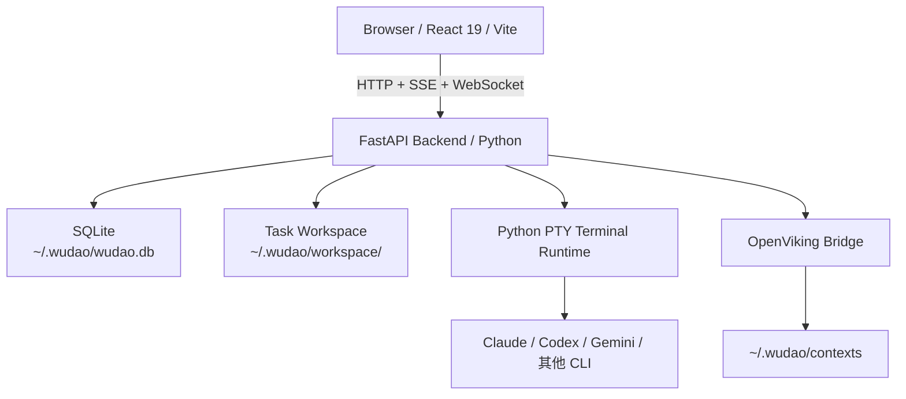

# 悟道（Wudao）

个人 AI 工作站，用来把多种 AI 工具串成可执行、可追踪、可沉淀的任务闭环。

当前主线已经收敛为任务中心：

- 自然语言建任务
- Agentic Chat 澄清与规划
- 生成 `AGENTS.md`
- 在任务 workspace 内启动和恢复本地 CLI 终端
- 回看产物、会话与状态

## 当前能力

- **任务闭环**：从任务解析、规划对话到 `AGENTS.md` 产物生成与终端执行都落在同一个任务里
- **任务工作台**：任务详情页为统一工作台，左侧是 Agentic Chat，右侧是多终端与产物抽屉
- **产物单一事实源**：`AGENTS.md` 是主产物，workspace 内同时维护 `CLAUDE.md`、`GEMINI.md` 两个兼容软链
- **多 Provider 统一接入**：统一管理 Claude、Kimi、GLM、MiniMax、Qwen、OpenAI、Gemini 等模型配置
- **记忆系统**：支持用户记忆、Wudao Agent 全局记忆与 OpenViking Embedded 记忆查看
- **运行态可观测**：Dashboard 聚合任务统计与 Provider 用量，任务聊天已支持结构化 Agent timeline

## 系统架构



## 技术栈

- **Monorepo**：pnpm workspace
- **前端**：Vite + React 19 + TypeScript + Tailwind CSS + zustand + xterm.js
- **后端**：FastAPI + sqlite3 + Python PTY + httpx
- **测试**：前端 Vitest；后端 pytest + FastAPI `TestClient`
- **运行时**：Node.js 22+、Python 3.12+，Python 依赖与命令默认通过 `uv` 驱动

## 快速开始

```bash
pnpm install
pnpm dev
```

常用验证命令：

```bash
pnpm test
pnpm --filter web build
```

- 前端：`http://localhost:5173`
- 后端：`http://localhost:3000`

## 目录结构

```text
wudao/
├── AGENTS.md
├── README.md
├── docs/
│   ├── design/
│   └── changelog.md
├── packages/
│   ├── web/          # React 前端
│   └── server/       # FastAPI 后端
├── scripts/
│   └── dev.sh        # 前后端联合开发入口
├── status.md
└── workspace/        # 仓库内临时文件目录
```

## 关键文档

- [任务工作台方案](docs/design/task-workspace-integration.md)
- [任务上下文注入](docs/design/task-context-injection.md)
- [Agentic Chat 工具化](docs/design/agentic-chat-tooling.md)
- [OpenViking 记忆管理](docs/design/openviking-context-integration.md)
- [后端 Python 重构](docs/design/server-python-refactor.md)
- [前端开发规范](docs/design/frontend-guidelines.md)
- [当前开发进度](status.md)
