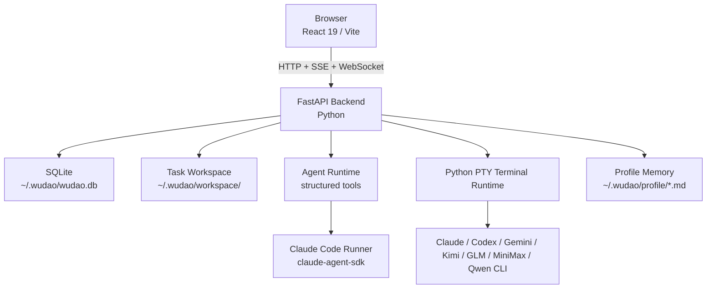

# 悟道（Wudao）

个人 AI 工作站，用来把多种 AI 工具串成可执行、可追踪、可沉淀的任务闭环。

核心流程：

- 自然语言创建任务
- Agentic Chat 澄清目标、规划步骤、调用工具
- 生成或同步任务 workspace 内的 `AGENTS.md`
- 在同一个任务工作台中使用本地 CLI 终端与 Claude Code Runner
- 回看结构化对话、Runner 历史、终端会话、任务产物与状态
- 通过用户记忆和 Wudao Agent 记忆保留长期上下文

## 当前能力

- **任务中心**：支持任务解析、创建、筛选、分页、排序、优先级 P0-P4、截止时间、完成归档与统计摘要
- **Agentic Chat**：基于结构化 run/message 表、typed SSE 与工具协议，支持文本、工具调用、工具结果、错误和产物更新
- **任务工作台**：左侧是 Agentic Chat，右侧是按任务记忆布局的终端、Agent Runner、产物三个独立抽屉
- **任务产物**：`AGENTS.md` 是主产物，任务 workspace 内自动维护 `CLAUDE.md`、`GEMINI.md` 兼容软链
- **Agent 工具**：支持 workspace 读写与 patch、workspace 搜索、跨任务读取 `AGENTS.md`、终端快照、`invoke_claude_code_runner`
- **Claude Code Runner**：通过 `claude-agent-sdk` 在任务 workspace 中执行 coding 工作，持久化 run 和事件，并在前端面板中回放
- **多 Provider 管理**：统一维护 Claude、Kimi、GLM、MiniMax、Qwen、OpenAI、Gemini 等模型配置、默认项、排序与用量查询
- **本地记忆**：用户记忆与 Wudao Agent 全局记忆保存在本机 profile 目录，并注入任务解析、文档生成和聊天上下文
- **本地终端**：后端通过 Python PTY 和 WebSocket 管理任务关联终端，支持会话创建、恢复、列表、关闭与输出快照

## 系统架构



## 技术栈

- **Monorepo**：pnpm workspace
- **前端**：Vite 6 + React 19 + TypeScript 5 + Tailwind CSS v4 + HeroUI v3 + zustand + i18next + lucide-react + framer-motion + xterm.js
- **后端**：FastAPI + sqlite3 + SSE + WebSocket + Python PTY + httpx + claude-agent-sdk
- **测试**：前端 Vitest；后端 pytest + FastAPI `TestClient`
- **运行时**：Node.js 22+、Python 3.12+，Python 依赖与命令默认通过 `uv` 驱动

## 快速开始

```bash
pnpm install
pnpm dev
```

- 前端：`http://localhost:5173`
- 后端：`http://127.0.0.1:3000`
- `pnpm install` 会在缺少系统 `uv` 时自动安装项目本地 `uv` 到 `workspace/tools/uv`
- 安装流程随后会执行 `uv sync --project packages/server --locked --all-groups`
- `uv` 缓存默认写到仓库 `workspace/uv-cache`

## 常用命令

```bash
pnpm dev
pnpm test

pnpm --filter web dev
pnpm --filter web build
pnpm --filter web test
pnpm --filter web exec tsc --noEmit --noUnusedLocals --noUnusedParameters

pnpm --filter server dev
pnpm --filter server start
pnpm --filter server test
```

## 运行时数据

- `WUDAO_HOME`：运行数据根目录，默认 `~/.wudao`
- `WUDAO_DB_PATH`：SQLite 数据库路径，默认 `~/.wudao/wudao.db`
- `~/.wudao/workspace/<taskId>/`：任务 workspace 与 `AGENTS.md` 产物
- `~/.wudao/profile/user-memory.md`：用户记忆
- `~/.wudao/profile/wudao-agent-memory.md`：Wudao Agent 全局记忆
- `workspace/`：仓库内临时文件、项目本地 `uv` 与 `uv` 缓存目录

## 目录结构

```text
wudao/
├── AGENTS.md
├── CLAUDE.md -> AGENTS.md
├── GEMINI.md -> AGENTS.md
├── README.md
├── docs/
│   ├── changelog.md
│   └── design/frontend-guidelines.md
├── packages/
│   ├── web/          # React 前端
│   └── server/       # FastAPI 后端
├── scripts/
│   ├── dev.sh
│   ├── ensure-uv.sh
│   ├── sync-server-python.sh
│   └── uv.sh
├── status.md
└── workspace/
```

## 关键文档

- [协作规则](AGENTS.md)
- [前端开发规范](docs/design/frontend-guidelines.md)
- [当前开发进度](status.md)
- [用户视角变更记录](docs/changelog.md)
