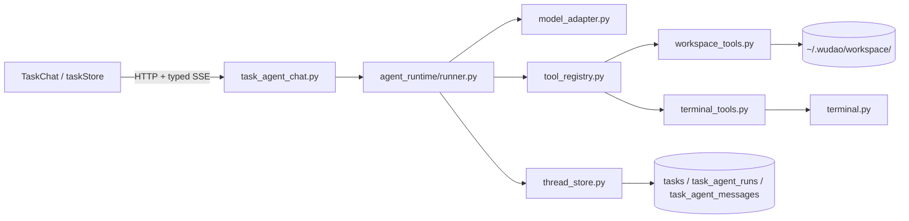
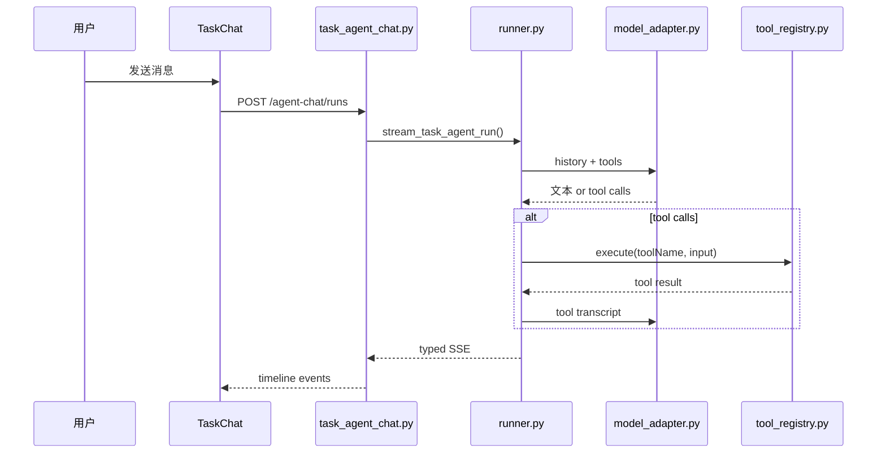

# Agentic Chat 工具化设计方案

> 目标：让任务详情页里的聊天从“纯文本规划”升级为“可读写任务 workspace 的受控 Agent Runtime”。
> v0.3 · 2026-03-16（按当前已落地实现与未完成边界收口）

## 1. 当前状态

### 已落地

- [x] 后端新增 `GET /api/tasks/{task_id}/agent-chat/thread`
- [x] 后端新增 `POST /api/tasks/{task_id}/agent-chat/runs`
- [x] SQLite 新增 `task_agent_runs` 与 `task_agent_messages`
- [x] 前端 `taskStore` 与 `TaskChat` 已切到结构化 timeline
- [x] 已支持 7 个工具：
  - `workspace_list`
  - `workspace_read_file`
  - `workspace_search_text`
  - `workspace_write_file`
  - `workspace_apply_patch`
  - `task_read_context`
  - `terminal_snapshot`
- [x] 写工具命中 `AGENTS.md` 时会同步 `tasks.agent_doc`，并发出 `artifact.updated`
- [x] 结构化失败时可降级为普通 assistant 文本，不中断整轮 run
- [x] 新 run 会继续把纯文本结果投影回 `tasks.chat_messages`，兼容旧链路
- [x] 首轮对话默认优先澄清用户意图，而不是主动探查当前 workspace
- [x] 常见工具误用（如参数无效、目标上下文不存在）会回流为失败的 `tool_result`，供模型继续对话，而不是立刻打断整轮 run

### 还没做

- [ ] 审批流与 `approve / reject / cancel` 路由
- [ ] 基于 `checkpoint_json` 的 run 恢复
- [ ] `web_search` 工具
- [ ] `terminal_send_input` / `terminal_start_session`
- [ ] `AGENTS.md` 的自动 artifact sync
- [ ] 真正以 `task_agent_messages` 为唯一聊天事实源

## 2. 设计目标

当前 Agentic Chat 要解决的问题不是“把一个大模型嵌到聊天框里”，而是把以下几件事打通：

1. 任务聊天能读取当前 workspace 和终端上下文
2. 任务聊天能在任务级安全边界内修改 workspace
3. 聊天时间线能展示工具调用与工具结果，而不是只显示纯文本
4. 运行记录可以持久化，后续能承接审批、恢复和更细的事件流
5. 首轮默认以对话补齐任务信息，只有在用户明确要求或确有必要时才读取 workspace / 跨任务上下文

## 3. 当前架构

设计原则：

- 保留现有 `FastAPI + SQLite + Python PTY` 基础设施
- 不直接引入 LangChain / LangGraph 作为核心执行器
- 先用最小可用的自建 Runtime 收口协议与状态
- 工具边界严格限制在任务 workspace 与任务关联终端

## 4. 当前接口与事件

### 4.1 HTTP 接口

| 接口 | 作用 |
|------|------|
| `GET /api/tasks/{task_id}/agent-chat/thread` | 返回一个任务的结构化线程快照 |
| `POST /api/tasks/{task_id}/agent-chat/runs` | 启动一轮新的 Agent run，并通过 SSE 返回事件流 |

### 4.2 前端当前消费的事件

前端 `services/api.ts` 当前对外暴露的事件类型：

| 事件 | 作用 |
|------|------|
| `run.started` | 建立新的 run |
| `message.delta` | assistant 文本流式增量 |
| `message.completed` | 一条结构化消息完成，包括文本、工具调用、工具结果、错误等 |
| `run.completed` | 本轮 run 完成 |
| `run.failed` | 本轮 run 失败 |
| `artifact.updated` | 预留给产物刷新；当前前端收到后会重新拉取任务详情 |

补充说明：

- `runner.py` 还会发出 `tool.started` / `tool.completed`，但当前前端没有显式消费它们
- 当前 UI 主要依赖 `message.completed` 来渲染工具卡片

### 4.3 与 legacy chat 的关系

当前仓库里并存两条聊天链路：

1. `POST /api/tasks/{task_id}/chat`
   - legacy 纯文本 SSE
   - 事件只有 `delta / done / error`
   - 仍保留给兼容路径使用

2. `POST /api/tasks/{task_id}/agent-chat/runs`
   - 结构化 typed SSE
   - 支持工具调用与结构化 timeline
   - 当前任务工作台默认走这条链路

## 5. 当前数据结构

### 5.1 `task_agent_runs`

| 字段 | 用途 |
|------|------|
| `id` | run id |
| `task_id` | 归属任务 |
| `provider_id` | 本轮使用的 provider |
| `status` | `running / waiting_approval / completed / failed / cancelled` |
| `checkpoint_json` | 为后续恢复预留，当前未实际使用 |
| `last_error` | 失败信息 |
| `created_at` / `updated_at` | 时间戳 |

### 5.2 `task_agent_messages`

| 字段 | 用途 |
|------|------|
| `id` | message id |
| `task_id` / `run_id` | 归属任务与 run |
| `seq` | 线程内顺序号 |
| `role` | `system / user / assistant / tool` |
| `kind` | `text / tool_call / tool_result / approval / artifact / error` |
| `status` | `streaming / completed / failed / waiting_approval` |
| `content_json` | 结构化载荷 |
| `created_at` / `updated_at` | 时间戳 |

### 5.3 当前前端投影逻辑

前端 `taskStore.ts` 会把 `task_agent_messages` 投影成 `AgentTimelineItem`：

- `text + user` -> `user_text`
- `text + assistant` -> `assistant_text`
- `tool_call` -> 工具调用卡片
- `tool_result` -> 工具结果卡片
- `artifact` -> 产物卡片
- `error` -> 错误卡片

同时，相邻的 `tool_call + tool_result` 会在 `TaskChat.tsx` 中合并成一个可折叠工具消息框。

## 6. 当前工具集合与边界

### 6.1 已实现工具

| Tool | 作用 | 默认策略 |
|------|------|----------|
| `workspace_list` | 列出 task workspace 内文件/目录 | auto |
| `workspace_read_file` | 读取文本文件，可按行截断 | auto |
| `workspace_search_text` | 在 workspace 内搜索文本 | auto |
| `workspace_write_file` | 写入或新建文本文件 | auto |
| `workspace_apply_patch` | 对 workspace 文件应用 unified diff patch | auto |
| `task_read_context` | 按任务 ID 直接读取目标任务 workspace 下的 `AGENTS.md` 上下文 | auto |
| `terminal_snapshot` | 读取当前任务关联终端的最近输出 | auto |

### 6.2 安全边界

当前工具实现已内置以下限制：

- 所有文件路径都必须是任务 workspace 内相对路径
- 禁止 `..` 路径逃逸
- 禁止读取 `.git`、`.env`、证书/私钥等敏感文件
- 文件读写、搜索结果与终端快照都有大小限制
- `workspace_apply_patch` 会先做 patch 校验再落地
- `task_read_context` 只允许按任务 ID 读取该任务 workspace 下的 `AGENTS.md`，不会开放跨任务任意文件读取，也不会回退到数据库里的 `agent_doc`
- 模型在首轮默认不应为了“先了解情况”就读取当前 workspace；当前任务的标题、类型与初步意图应先来自任务 seed message
- `task_read_context` 仅用于“参考其他任务”的显式场景；若参数无效或目标上下文不存在，当前实现会返回失败的工具结果，由模型决定改为追问用户或换用其他工具

### 6.3 明确未实现的工具

以下工具在文档里曾经被讨论过，但当前代码里还没有实现：

- `web_search`
- `terminal_send_input`
- `terminal_start_session`
- `context_read_memory`
- `mcp_proxy_*`

## 7. 当前单轮执行时序

## 8. 与 `AGENTS.md` 的当前关系

当前 `AGENTS.md` 仍然没有完全纳入 Agent Runtime：

- `generate-docs` 仍是独立接口 `POST /api/tasks/{task_id}/generate-docs`
- 生成文档后由 `task_service.py` 写回 `tasks.agent_doc` 与 workspace
- Agent Chat 虽然能直接写 workspace 文件，但还没有内建“更新 `AGENTS.md` 并同步 `tasks.agent_doc`”的统一 artifact 流
  - 例外：当写工具直接命中 workspace 根目录下的 `AGENTS.md` 时，当前实现会立即同步 `tasks.agent_doc`，并通过 `artifact.updated` 触发前端刷新主产物展示

这意味着当前存在两套并行能力：

1. 聊天运行时可以写 workspace 普通文件
2. 文档主产物仍通过专门的 generate-docs 流维护

后续要做的，是把这两套能力在 artifact 层收口。

## 9. 当前实现落点

| 文件 | 作用 |
|------|------|
| `packages/server/src/task_agent_chat.py` | Agent Chat 路由 |
| `packages/server/src/agent_runtime/runner.py` | 单轮 run loop 与事件发射 |
| `packages/server/src/agent_runtime/thread_store.py` | 结构化 run/message 持久化 |
| `packages/server/src/agent_runtime/model_adapter.py` | 多 Provider 工具调用文本协议适配 |
| `packages/server/src/agent_runtime/tool_registry.py` | 工具注册与执行入口 |
| `packages/server/src/agent_runtime/workspace_tools.py` | workspace 工具与安全边界 |
| `packages/server/src/agent_runtime/terminal_tools.py` | 终端只读工具 |
| `packages/web/src/stores/taskStore.ts` | timeline 状态、typed SSE 消费 |
| `packages/web/src/components/task-panel/TaskChat.tsx` | 时间线渲染、工具卡片、发送与中断 |

## 10. 下一阶段

二期最值得优先做的不是继续堆工具，而是补齐运行时闭环：

1. artifact sync：把 `AGENTS.md` 纳入统一产物模型
2. run 恢复：真正使用 `checkpoint_json`
3. approval：补 `waiting_approval` 的前后端闭环
4. web search：补外部信息读取能力
5. terminal bridge：谨慎开放受控写操作，而不是只读快照
