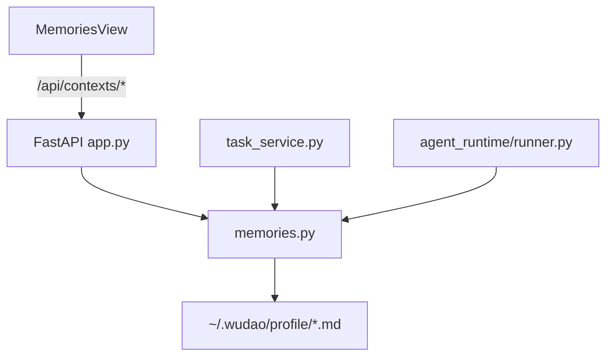

# 本地记忆系统方案

> v2.0 · 2026-04-06
> 本文描述当前记忆系统的最新收口方案：彻底移除外部记忆引擎依赖，只保留 Wudao 自己维护的用户记忆与 Agent 记忆。

## 1. 目标与范围

### 当前目标

- [x] 记忆能力只保留 `用户记忆` 与 `Agent 记忆`
- [x] 两类记忆统一落本地文件，不再依赖外部 bridge、worker 或镜像链路
- [x] 顶部“记忆”页只提供两块可编辑模块
- [x] 任务解析、`AGENTS.md` 生成、legacy chat 与 Agent Chat 共享同一套全局记忆注入源

### 当前不做

- [x] 不再维护任何外部记忆 workspace、状态探测或列表浏览能力
- [x] 不再保留“镜像成功/失败”这类额外保存语义
- [x] 不在本阶段引入新的数据库表或检索索引

## 2. 当前架构

设计原则：

- Wudao 只维护自己的本地记忆文件
- 记忆接口不依赖额外进程、SDK 或外部状态
- 用户记忆与 Agent 记忆共享统一的读写与 system message 组装逻辑

## 3. 接口与数据

### 3.1 HTTP 接口

| 接口 | 作用 |
|------|------|
| `GET /api/contexts/user-memory` | 读取 `~/.wudao/profile/user-memory.md` |
| `PUT /api/contexts/user-memory` | 更新用户记忆 |
| `GET /api/contexts/agent-memory` | 读取 `~/.wudao/profile/wudao-agent-memory.md` |
| `PUT /api/contexts/agent-memory` | 更新 Agent 记忆 |
| `POST /api/open-path` | 打开本地记忆文件 |

### 3.2 关键本地路径

| 路径 | 作用 |
|------|------|
| `~/.wudao/profile/user-memory.md` | 用户长期记忆源文件 |
| `~/.wudao/profile/wudao-agent-memory.md` | Wudao Agent 全局记忆源文件 |

### 3.3 前端状态模型

记忆页当前不引入独立全局 store，而是由 `MemoriesView.tsx` 维护组件内状态：

- 当前模块切换
- 用户记忆内容、加载态、保存态与提示信息
- Agent 记忆内容、加载态、保存态与提示信息

## 4. 与任务系统的关系

当前记忆能力会参与以下链路：

- `parse_task_input()` 在自然语言建任务时注入用户记忆与 Agent 记忆
- `POST /api/tasks/{task_id}/generate-docs` 在生成 `AGENTS.md` 时注入同一套全局记忆
- legacy `/api/tasks/{task_id}/chat` 把全局记忆作为 `system prompt` 注入
- Agent Runtime 通过 `get_global_memory_system_messages()` 把它们带入每轮 run

因此这套设计的真实作用是：

1. 记忆页负责维护长期上下文
2. 任务解析、普通聊天与 Agent Chat 共享同一套长期记忆源
3. 记忆系统完全收口在 Wudao 自己的本地文件与应用逻辑中

## 5. 实现落点

| 文件 | 作用 |
|------|------|
| `packages/server/src/app.py` | 挂载本地记忆接口 |
| `packages/server/src/memories.py` | 本地记忆文件读写与 system message 组装 |
| `packages/server/src/paths.py` | 维护 profile / workspace 等本地路径 |
| `packages/server/src/path_guard.py` | 控制允许打开的本地路径范围 |
| `packages/web/src/components/MemoriesView.tsx` | 记忆页 UI、模块切换、编辑与保存 |
| `packages/web/src/services/api.ts` | contexts API 类型与调用 |

## 6. 边界与风险

### 边界

- 记忆内容为空时，对应本地文件会被删除
- 本地文件不存在时，接口返回空内容与标准路径，不视为错误
- 记忆页不再展示第三种“浏览型”模块

### 风险

- 记忆能力当前完全依赖本地文件，可移植性由用户自己的 `~/.wudao/profile/` 管理方式决定
- 若后续重新引入检索或结构化记忆，需要单独设计新能力，不能复用已删除的旧 bridge 语义

## 7. 当前验收口径

1. 打开“记忆”页后，只看到 `用户记忆` 与 `Agent 记忆` 两个模块。
2. 两类记忆都能读写本地文件，并在保存后直接返回最新内容与文件路径。
3. 服务启动与关闭不再预热或清理任何外部记忆 worker。
4. 任务解析、legacy chat 与 Agent Chat 使用的仍是同一套全局记忆注入来源。
