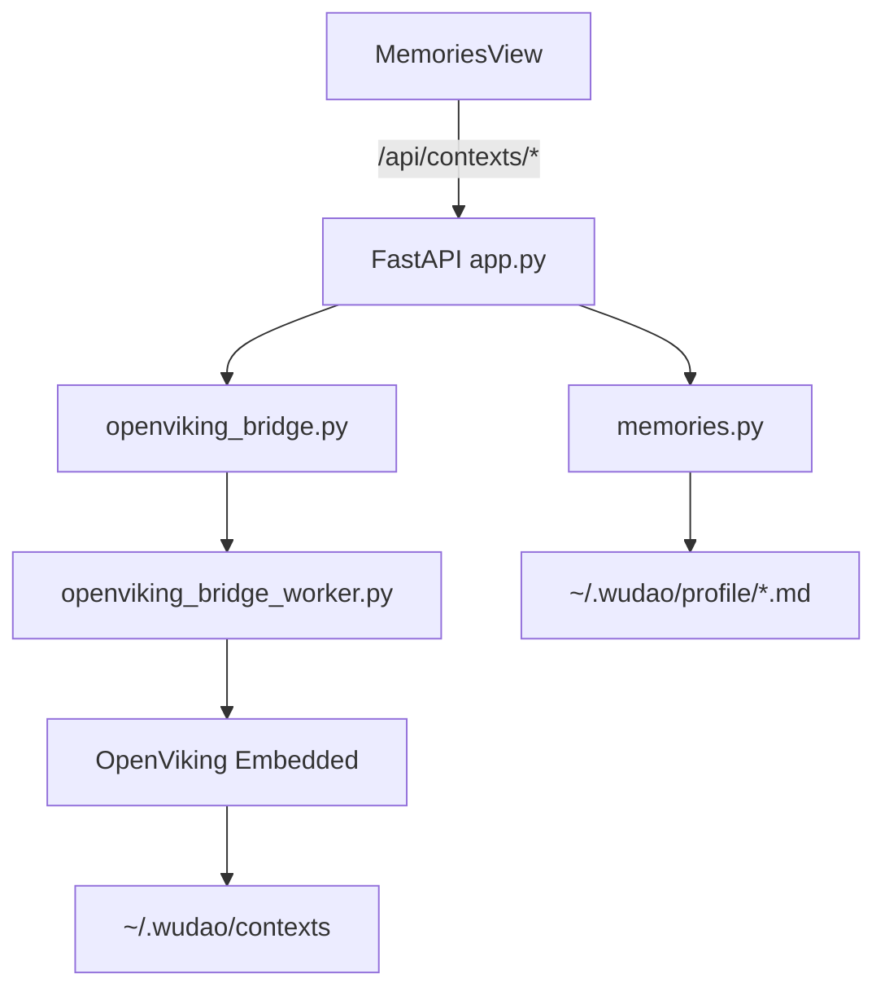

# OpenViking 记忆管理接入方案

> v1.2 · 2026-03-16
> 本文描述当前已落地的 OpenViking Embedded 记忆能力，而不是早期“只读查看”草案。

## 1. 目标与范围

### 当前已完成

- [x] `wudao server` 通过本地 Python bridge 访问 OpenViking Embedded
- [x] OpenViking workspace 固定使用 `~/.wudao/contexts`
- [x] 服务启动时会自动拉起常驻 OpenViking bridge worker，并复用同一 Embedded 单例
- [x] 顶部导航新增“记忆”页
- [x] 记忆页拆分为 `用户记忆 / Agent 记忆 / OpenViking 记忆` 三个模块
- [x] 支持查看 OpenViking 状态、配置路径、workspace 路径与记忆列表
- [x] 支持读写 `~/.wudao/profile/user-memory.md`
- [x] 支持读写 `~/.wudao/profile/wudao-agent-memory.md`
- [x] 保存本地记忆后会尽力镜像到 OpenViking 对应 memory

### 当前不做

- [x] 不对前端暴露 OpenViking 原生 HTTP Server
- [x] 不在 Wudao 自己的 SQLite 中存一份 OpenViking 数据副本
- [x] 不提供单条 OpenViking memory 的删除/编辑 UI
- [x] 不在本阶段把 OpenViking 检索直接接入 Agent Runtime 工具链

## 2. 当前架构

设计原则：

- Wudao 只暴露自己的 `/api/contexts/*` 接口
- OpenViking 相关失败会转成可诊断的应用层错误
- FastAPI 启动时会先预热 worker；后续 `status / list / sync` 复用同一个 Embedded 进程内单例
- 用户记忆与 Agent 记忆优先落本地文件，再尽力镜像到 OpenViking

## 3. 接口与数据

### 3.1 HTTP 接口

| 接口 | 作用 |
|------|------|
| `GET /api/contexts/status` | 返回 OpenViking 可用性、模式、workspace、配置路径、Python 信息 |
| `GET /api/contexts/memories` | 返回当前 OpenViking 中的用户/Agent 记忆列表 |
| `GET /api/contexts/user-memory` | 读取 `~/.wudao/profile/user-memory.md` |
| `PUT /api/contexts/user-memory` | 更新用户记忆，并尽力镜像到 OpenViking user memory |
| `GET /api/contexts/agent-memory` | 读取 `~/.wudao/profile/wudao-agent-memory.md` |
| `PUT /api/contexts/agent-memory` | 更新 Agent 记忆，并尽力镜像到 OpenViking agent memory |
| `POST /api/open-path` | 打开记忆目录、配置路径或本地记忆文件 |

### 3.2 关键本地路径

| 路径 | 作用 |
|------|------|
| `~/.wudao/contexts` | OpenViking Embedded workspace |
| `~/.wudao/profile/user-memory.md` | 用户长期记忆源文件 |
| `~/.wudao/profile/wudao-agent-memory.md` | Wudao Agent 全局记忆源文件 |

### 3.3 前端状态模型

记忆页当前不引入独立全局 store，而是由 `MemoriesView.tsx` 维护组件内状态：

- OpenViking 状态与错误
- OpenViking 记忆列表
- 用户记忆内容、保存中状态、镜像告警
- Agent 记忆内容、保存中状态、镜像告警
- 模块切换、作用域筛选、关键词搜索

## 4. 与任务系统的关系

当前记忆能力不只是“展示页”，还会参与任务链路：

- `parse_task_input()` 在自然语言建任务时会注入用户记忆与 Agent 记忆
- `POST /api/tasks/{task_id}/generate-docs` 在生成 `AGENTS.md` 时也会注入同一套全局记忆
- legacy `/api/tasks/{task_id}/chat` 会把全局记忆作为 `system prompt` 注入
- Agent Runtime 也通过 `get_global_memory_system_messages()` 把它们作为系统消息带入每轮 run

因此这套设计的真实作用是：

1. 记忆页负责管理长期上下文
2. 任务解析、普通聊天与 Agent Chat 共享同一套长期记忆源
3. OpenViking 当前承担外挂记忆存储与浏览，不直接成为主业务数据库

## 5. 实现落点

| 文件 | 作用 |
|------|------|
| `packages/server/src/app.py` | 挂载 `/api/contexts/*` 接口，并在服务启动时预热 OpenViking worker |
| `packages/server/src/memories.py` | 本地记忆文件读写与 system message 组装 |
| `packages/server/src/openviking_bridge.py` | 管理常驻 bridge worker、Python 解释器选择与错误归一化 |
| `packages/server/src/openviking_bridge_worker.py` | 在独立 Python 进程中持有 OpenViking Embedded 单例并处理 `status / list / sync` 请求 |
| `packages/server/src/openviking_bridge_cli.py` | Worker 与一次性 bridge 复用的 OpenViking 辅助函数 |
| `packages/web/src/components/MemoriesView.tsx` | 记忆页 UI、模块切换、编辑与保存 |
| `packages/web/src/services/api.ts` | contexts API 类型与调用 |

## 6. 边界与风险

### 边界

- OpenViking 不可用时，用户记忆与 Agent 记忆仍然可以正常保存到本地文件
- OpenViking worker 启动失败不会阻断 Wudao 主服务，只会让记忆相关接口降级
- 镜像失败不会阻断本地保存，只会返回 warning
- OpenViking 记忆列表为空时，页面显示空状态，不视为错误

### 风险

- Python bridge 超时或依赖缺失时，状态接口会进入降级
- OpenViking 配置合法但底层模型不可用时，错误信息可能来自 bridge，需要在 UI 中保留原始诊断
- 后续若把检索能力接入 Agent Runtime，还需要补权限、缓存与时序设计

## 7. 当前验收口径

1. 打开“记忆”页后，可以看到三个模块，而不是单一只读列表。
2. 用户记忆和 Agent 记忆都能读写本地文件，并在镜像失败时给出警告。
3. OpenViking 可用时，可以展示状态、路径和记忆列表；不可用时也能给出明确错误。
4. 任务解析、legacy chat 与 Agent Chat 使用的是同一套全局记忆注入来源。
