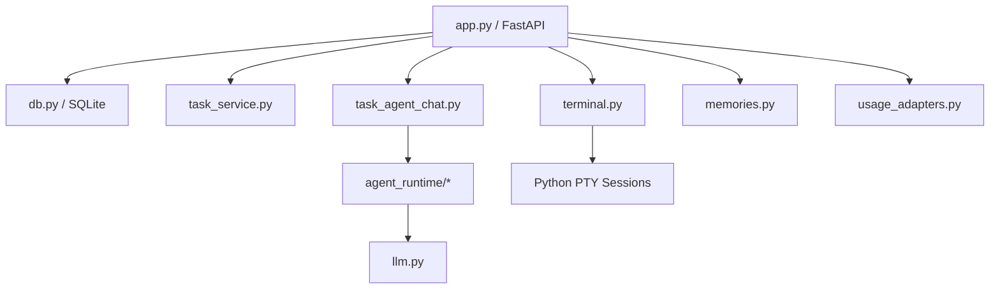

# 后端 Python 重构完成记录

> `packages/server` 已完成从 Node.js / TypeScript 到 Python / FastAPI 的迁移。
> v1.1 · 2026-03-16（按当前仓库真实状态收口）

## 1. 目标达成情况

### 已完成

- [x] `packages/server` 运行时已切换为 Python
- [x] 前端继续沿用原有 `/api`、SSE 与 `/ws/terminal` 协议
- [x] SQLite、任务 workspace、终端会话恢复、OpenViking bridge、用量聚合与本地路径打开能力均已迁移
- [x] 后端自动化测试已切换到 `pytest + FastAPI TestClient`
- [x] 原 TypeScript 服务端不再是默认实现路径

### 本次迁移没有做的事

- [x] 没有借迁移重写前端状态架构
- [x] 没有改变任务、Provider、记忆系统的业务语义
- [x] 没有让 Agent Runtime 取代终端体系；两者当前并存

## 2. 当前后端结构

当前关键模块：

| 模块 | 作用 |
|------|------|
| `app.py` | 主应用装配、HTTP 路由、legacy SSE、`/ws/terminal` |
| `db.py` | SQLite 初始化、兼容迁移、默认 Provider seed |
| `task_service.py` | 任务领域逻辑、文档生成、状态流转、会话绑定 |
| `task_agent_chat.py` | Agent Chat thread / run API |
| `agent_runtime/*` | 结构化 run、消息存储、工具注册与执行 |
| `terminal.py` | WebSocket 终端、PTY 生命周期、attach/list/close/recover |
| `llm.py` | 多 Provider 协议适配，含 Anthropic / OpenAI Responses / Chat Completions |
| `memories.py` | 用户记忆、Agent 记忆与 system message 注入 |

## 3. 当前存储与目录约定

### SQLite

- 默认数据库文件：`~/.wudao/wudao.db`
- 主要表：
  - `providers`
  - `tasks`
  - `task_agent_runs`
  - `task_agent_messages`

### 运行时目录

| 路径 | 作用 |
|------|------|
| `~/.wudao/workspace/<taskId>/` | 任务 workspace |
| `~/.wudao/profile/` | 头像、用户记忆、Agent 记忆 |
| `~/.wudao/contexts/` | OpenViking Embedded workspace |

## 4. 协议兼容结果

迁移后的后端继续保留以下前端依赖接口：

- `GET/POST/PUT/PATCH/DELETE /api/*`
- `POST /api/tasks/{task_id}/chat` 的 SSE 文本流
- `GET /api/tasks/{task_id}/agent-chat/thread`
- `POST /api/tasks/{task_id}/agent-chat/runs`
- `WebSocket /ws/terminal`

兼容重点：

- 任务、设置、记忆、用量、头像、本地路径打开接口保持在 `/api`
- 终端仍走 WebSocket，不要求前端切到轮询或新协议
- legacy chat 与 Agent Chat 同时存在，便于迁移期平滑兼容

## 5. 测试体系

当前服务端测试基线：

- 执行命令：`pnpm --filter server test`
- 实际入口：`TZ=Asia/Shanghai uv run --project . pytest`
- Route / WebSocket 测试：`FastAPI TestClient`
- 外部依赖：通过 monkeypatch / mock 隔离

测试覆盖重点：

- Provider CRUD
- Task CRUD、排序、分页、状态流转
- 任务解析、legacy chat、文档生成
- Agent Chat thread / run / 工具链
- OpenViking bridge 与记忆接口
- 终端 list / create / attach / close / resize 关键协议

## 6. 剩余已知风险

- PTY 自动化覆盖已补齐，但 `create / resume` 仍需结合本机真实 CLI 做真机回归
- 多 Provider 网关兼容仍会持续变化，`llm.py` 需要跟随上游 API 行为迭代
- Agent Runtime 当前只有最小可用工具链，审批、恢复和 web search 仍在后续路线图中

## 7. 当前验收口径

满足以下条件时，可认为 Python 重构已经与代码保持一致：

1. `pnpm dev` 会通过 `scripts/dev.sh` 同时拉起前端和 Python 后端。
2. `pnpm --filter server test` 默认走 `uv + pytest`，而不是 Node 测试栈。
3. 后端真实代码路径位于 `packages/server/src/*.py` 与 `packages/server/tests/`。
4. 当前数据库、workspace、记忆目录约定都落在 `~/.wudao/` 下，而不是包目录内部。
