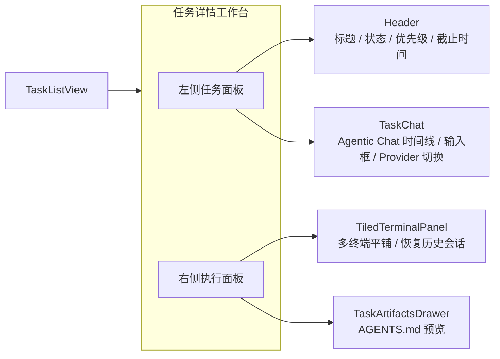
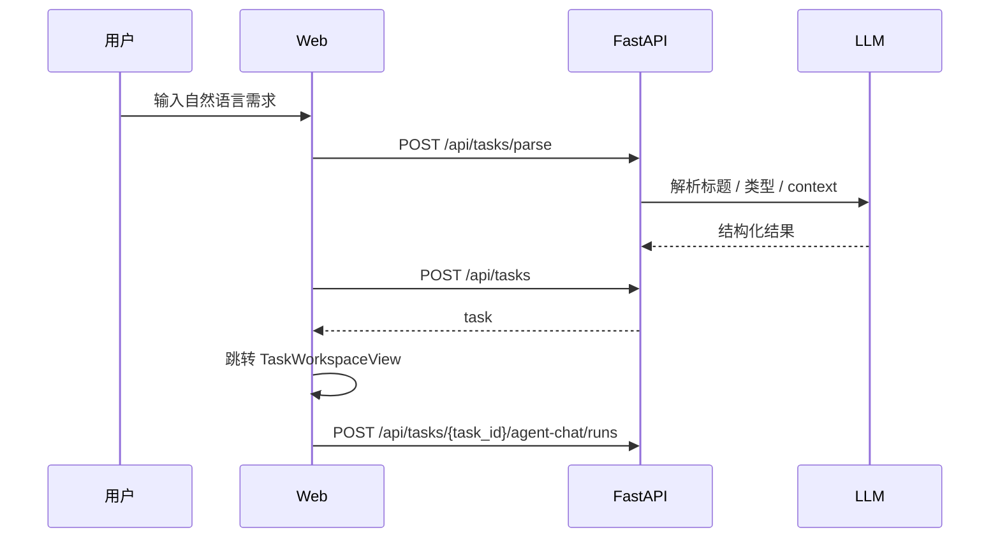

# 任务工作台一体化

> 将任务详情页作为唯一任务工作台入口：左侧负责任务信息与 Agentic Chat，右侧负责终端与产物。
> v2.5 · 2026-03-16（按当前前后端实现收口）

---

## 一、背景与目标

当前版本里，“任务工作台”已经不是独立 tab，而是 `?view=tasks&taskId=...` 路由下的核心详情页。创建任务成功后，前端会带 `autoStartChat=1` 进入该页并触发首轮 Agent Chat。用户进入一个任务后，应当在同一个页面内完成：

- 查看与编辑任务元数据
- 通过 Agentic Chat 澄清任务、读取 workspace、查看工具结果
- 生成或重新生成 `AGENTS.md`
- 启动、恢复、关闭与该任务绑定的本地 CLI 终端
- 查看产物并打开任务 workspace

本设计的核心目标是：把“聊天、产物、终端、任务状态”收敛为一个可持续工作的任务单元，而不是继续维护分散的多阶段页面。

### 当前不做

- 不恢复旧的五阶段 UI（Context / Planning / Execution / Review / Summary）
- 不引入独立“工作台”一级导航
- 不把终端执行替换成纯聊天代理
- 不让任务工作台脱离任务详情单独存在

---

## 二、页面结构

### 2.1 入口与视图切换

`App.tsx` 当前维护四个一级视图：

- `dashboard`
- `tasks`
- `memories`
- `settings`

其中 `tasks` 视图有两种形态：

- `TaskListView`：任务列表页
- `TaskWorkspaceView`：带 `taskId` 时进入任务详情工作台

### 2.2 工作台布局



### 2.3 左侧任务面板

左侧由 `TaskWorkspaceView` 组织，包含两块核心内容：

1. `Header`
   - 返回任务列表
   - 打开任务抽屉并切换任务（支持 `F1` 快捷键）
   - 编辑标题
   - 编辑优先级 `P0-P4`
   - 编辑截止时间
   - 在 `execution / done` 之间切换
   - 展开/收起终端区
   - 展开/收起产物抽屉
   - 打开 workspace、删除任务

2. `TaskChat`
   - 渲染结构化 Agent timeline，而不是只渲染纯文本聊天
   - 支持普通用户消息、assistant 文本、工具调用/结果、artifact、错误等消息形态
   - 支持 Provider 切换
   - 支持中断当前 Agent run
   - 支持生成/重新生成 `AGENTS.md`

补充说明：

- 创建任务进入详情页后，如果该任务还没有 timeline，会自动发送首条种子消息
- 该种子消息由 `buildInitialTaskInfoMessage()` 基于标题、类型、上下文等元数据拼装
- 当前前端默认走 `/api/tasks/{task_id}/agent-chat/*` 结构化链路；旧 `/chat` SSE 仍保留为兼容路径

### 2.4 右侧执行面板

右侧由 `TiledTerminalPanel` 与 `TaskArtifactsDrawer` 组合：

- 顶部操作区（终端面板内部）：
  - 新建终端
  - 恢复全部历史会话
- 会话区：
  - 展示任务已绑定的历史 `session_ids`
  - 对未打开但可恢复的历史会话提供恢复入口
- 终端区：
  - 无终端时展示空状态
  - 有终端时按 1/2/3 列平铺展示
  - 支持拖拽重排
- 产物抽屉：
  - 当前主产物是 `AGENTS.md`
  - 预览基于 Markdown 渲染
  - 可直接打开任务 workspace

---

## 三、数据模型与状态

### 3.1 `tasks` 表中的关键字段

| 字段 | 作用 |
|------|------|
| `id` | 任务 ID，格式 `YYYY-MM-DD-n`，按 `Asia/Shanghai` 生成 |
| `title` / `type` | 任务基础信息 |
| `status` | 当前只保留 `execution` / `done` |
| `context` | 建任务阶段抽取的初步意图摘要 |
| `agent_doc` | 主产物文本，对应 workspace 中的 `AGENTS.md` |
| `chat_messages` | legacy 纯文本 `user/assistant` 历史，用于兼容旧聊天链路与文档生成 |
| `session_ids` | 与任务绑定的会话 ID 列表 |
| `session_names` | 会话展示名称映射 |
| `session_providers` | 会话与 Provider 的绑定关系 |
| `priority` / `due_at` | 排序与展示元数据；优先级为 `P0-P4`，数值 `0-4`，`0` 最高 |
| `provider_id` | 当前任务默认 Provider |
| `status_log` | 状态流转日志 |

### 3.2 Agent Chat 结构化状态

除了 `tasks.chat_messages` 之外，当前还引入了结构化 Agent Runtime 存储：

- `task_agent_runs`
- `task_agent_messages`

它们负责记录：

- 每一轮 run 的状态
- 结构化消息时间线
- 工具调用与工具结果
- 错误与后续可扩展的 artifact/approval 信息

前端 `taskStore` 在进入详情页时会优先读取 `/api/tasks/{task_id}/agent-chat/thread`，并把 `task_agent_messages` 投影成 timeline；如果结构化时间线为空，再回退显示 legacy `chat_messages`。

### 3.3 会话关联策略

当前会话关联策略有三个重点：

1. 优先持久化 CLI 可恢复的真实 session id
2. 对无法恢复的 Provider，不把纯后端运行时 session id 当作长期事实源
3. 当前端在 WebSocket `list` 中拿到更稳定的 `cliSessionId` 时，会用真实 id 替换旧绑定，而不是重复追加

对不同 Provider 的处理：

- Claude：创建时通常就能拿到稳定的可恢复会话 ID
- OpenAI/Codex 一类运行时可链接 Provider：允许先用运行时 session id 维持任务关联，再在后续同步时收敛
- Gemini / 其他固定 session provider：只有拿到真实 CLI 会话 ID 后才会长期持久化

---

## 四、关键流程

### 4.1 创建任务并自动开始首轮对话



### 4.2 生成 `AGENTS.md`

```text
TaskChat 点击“生成/重新生成”
  -> POST /api/tasks/{task_id}/generate-docs
  -> task_service.generate_and_persist_task_docs()
  -> 注入全局用户记忆 / Agent 记忆 system messages
  -> 更新 tasks.agent_doc
  -> 写入 ~/.wudao/workspace/<taskId>/AGENTS.md
  -> 重建 CLAUDE.md / GEMINI.md 软链
  -> 前端展开产物抽屉
```

### 4.3 新建终端

```text
点击“新建终端”
  -> 打开 NewTaskTerminalDialog
  -> 选择 provider / permission mode / 名称
  -> WebSocket create 到 /ws/terminal
  -> cwd = ~/.wudao/workspace/<taskId>/
  -> 若 AGENTS.md 已存在，则维护兼容软链
  -> 首条提示引导 CLI 先阅读 AGENTS.md
  -> 任务写回 session 关联
```

### 4.4 恢复历史终端

```text
刷新页面或重新进入任务
  -> 前端先读取 tasks.session_ids
  -> 再从 /ws/terminal list 获取当前活跃会话
  -> 能直接匹配的会话直接 attach
  -> 不在线但可恢复的会话走 resume
  -> 历史 id 已失效时直接报错，不退化到错误会话
```

### 4.5 打开 workspace

```text
点击“打开 Workspace”
  -> POST /api/tasks/{task_id}/open-workspace
  -> 若 tasks.agent_doc 非空，则物化 AGENTS.md
  -> 重建 CLAUDE.md / GEMINI.md 软链
  -> 调用系统 open 打开本地目录
```

### 4.6 Dashboard 统计

```text
Dashboard 进入或定时刷新
  -> GET /api/tasks/stats
  -> 返回 active / done / high_priority / all
  -> Dashboard 仅消费摘要，不再为统计拉全量任务列表
```

---

## 五、实现落点

| 文件 | 作用 |
|------|------|
| `packages/web/src/App.tsx` | 一级视图切换与任务详情路由装配 |
| `packages/web/src/components/TaskListView.tsx` | 任务列表、筛选、排序、创建入口 |
| `packages/web/src/components/TaskWorkspaceView.tsx` | 任务详情整体布局、自动首聊、产物抽屉与终端面板装配 |
| `packages/web/src/components/task-panel/Header.tsx` | 元数据编辑、状态切换、任务切换 |
| `packages/web/src/components/task-panel/TaskChat.tsx` | Agent timeline、输入区、工具卡片、生成文档入口 |
| `packages/web/src/components/TiledTerminalPanel.tsx` | 多终端平铺、恢复历史会话、拖拽重排 |
| `packages/web/src/components/TaskArtifactsDrawer.tsx` | `AGENTS.md` 预览与 workspace 打开入口 |
| `packages/web/src/stores/taskStore.ts` | 任务详情状态、legacy chat 与 agent chat 流 |
| `packages/web/src/stores/terminalStore.ts` | 前端终端会话状态与任务会话映射 |
| `packages/server/src/app.py` | 任务 HTTP API、legacy chat、workspace 打开与 `/ws/terminal` 挂载 |
| `packages/server/src/task_agent_chat.py` | Agent Chat thread / run 路由 |
| `packages/server/src/task_service.py` | 任务领域逻辑、文档生成、会话关联、统计摘要 |
| `packages/server/src/task_claude_md.py` | `AGENTS.md` 兼容软链维护 |
| `packages/server/src/terminal.py` | 终端 WebSocket、PTY 生命周期与会话恢复 |

---

## 六、验收口径

满足以下条件时，可认为当前任务工作台设计与实现一致：

1. 任务详情页是唯一工作台入口，不再依赖额外 tab。
2. 创建任务进入详情页后，若尚无时间线，会自动开始首轮 Agent Chat。
3. 任务聊天可以显示结构化工具消息，而不只是纯文本气泡。
4. 生成文档后，`AGENTS.md` 会进入 workspace，并在右侧抽屉预览。
5. 终端与任务绑定，刷新页面后仍能恢复已有会话或识别不可恢复状态。
